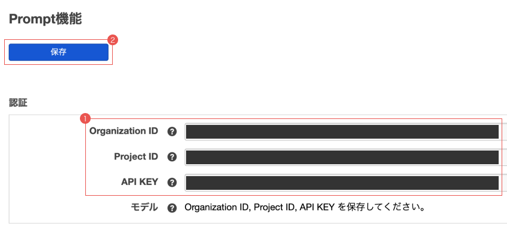
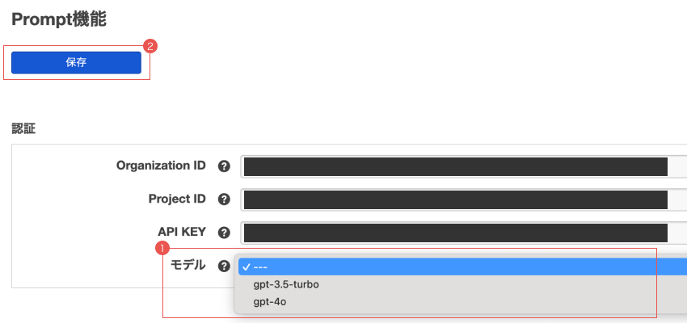
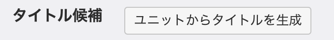
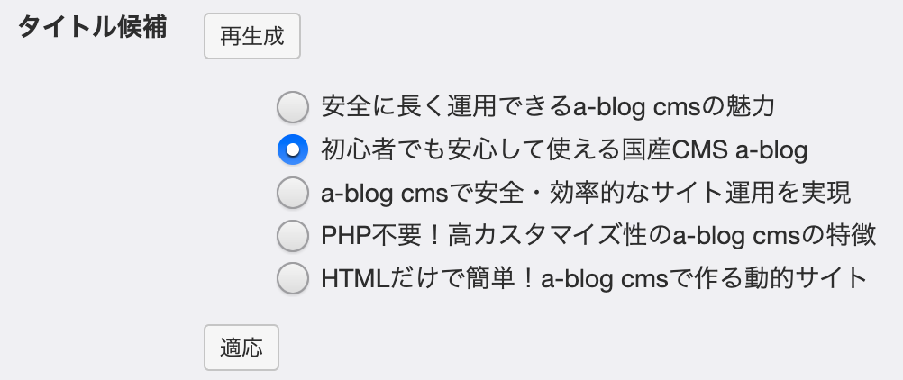
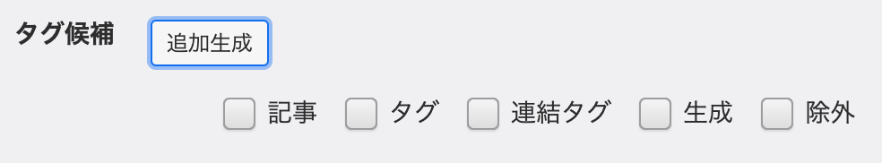

# AI拡張アプリ

a-blog cms の AI機能を拡張するアプリです。

## ダウンロード

最新版の拡張アプリは以下からダウンロードできます。

- [AI.zip をダウンロード（最新版）](https://github.com/appleple/acms-ai/raw/main/build/AI.zip)

バージョンを指定してダウンロードしたい場合や過去のバージョンは [build/](../build/) ディレクトリ、または [Releases](https://github.com/appleple/acms-ai/releases) を参照してください。

## 動作環境

- a-blog cms: Ver. 3.2.x (3.3+ not tested yet)
- PHP: 8.1 – 8.4 (8.5+ not tested yet)
- a-blog cms for Professional or Enterprise のみ（現状スタンダードライセンスでの利用はライセンス違反となります）

## サポートモデル

- gpt-5.4, gpt-5.4-pro, gpt-5.4-mini, gpt-5.4-nano

## 注意点
- ChatGPT の API KEY は利用できるモデルの制限をかけることができます。使用したいモデルが表示されない場合は、API KEY の設定を確認してみてください。
- このキーとモデルは、config として保存されます。config はキャッシュを残しますので、うまく設定できない場合はダッシュボードからコンフィグキャッシュをクリアしてください。

## インストール方法

拡張アプリをダウンロード後、zip ファイルを解凍して `extension/plugins/` に設置します。

設置が完了すると、「管理画面 -> 拡張アプリ」に `AI` という名前で本拡張アプリが表示されるので、インストールをクリックしインストールします。

## 使い方

### 準備：ChatGPT API からキーの取得
`https://platform.openai.com/docs/overview` へログインし、`Organization ID` と `Project ID` と `API KEY` を取得してください。

#### Organization ID
`Setting > Organization > General` から取得できます。

#### Project ID
`Setting > Project > General` から取得できます。初期では Default Project が作成されていますが、利用するアプリケーション毎に作成することをお勧めします。利用量が Project ごとに確認できます。

#### API KEY
`Dashboard > API Keys` の `Create new secret Key` からキーが取得できます。この時、利用する `Project ID` を指定します。
※ User API Keys もありますが、この拡張アプリは対応しておりません。

### a-blog cms の管理画面設定
準備で取得した `Organization ID` と `Project ID` と `API KEY` を AI管理画面で入力し、保存してください。



キーが正しく設定できると、モデルが選択できるようになります。利用するモデルを選択し、再度保存してください。



認証が完了したら、「プロンプト設定」でタイトル生成・タグ生成の機能を有効にし、必要に応じてカスタムプロンプトを設定してください。

## エントリー編集AI機能
「AI機能」ラベルのアコーディオンがSEO設定の下に追加されます。

### タイトル生成機能
「ユニットからタイトルを生成」ボタンをクリックすると、ユニットを元にタイトルが生成されます。



「再生成」ボタンをクリックするとタイトルが再生成されます。再生成すると、前回作成したタイトルは消えてしまいますのでご注意ください。「適応」ボタンをクリックすることでタイトルに反映されます。エントリーの保存をしないと、エントリーのタイトルとして保存されないのでご注意ください。



### タグ生成機能
「ユニットからタグを生成」ボタンをクリックすると、ユニットを元にタグが生成されます。


「追加生成」ボタンをクリックすると、前回のタグに加えて追加で生成されます。追加生成では、a-blog cms 本来のタグ設定と ChatGPT で生成したタグで選択されているタグの情報も加えて生成されるので、より精度の高いタグが生成されます。エントリーの保存をしないと、エントリーのタグとして保存されないのでご注意ください。



## AIアシスタント機能

### ライトエディタ連携
ライトエディタにある「AIアシスタント」ボタンをクリックすると、画面右側にチャットドロワーが開きます。現在の編集内容を文脈として、テキストの校正・要約・翻訳・書き直しなど、自由に AI へ指示できます。結果は「挿入」ボタンでエディタへ反映されます。

### `<acms-ai-assistant-button>` Web Component
テンプレートから直接 AI アシスタントを呼び出せる Web Component です。任意の `<textarea>` をターゲットに指定することで、カスタムフィールドなどエントリー編集画面の任意の場所にAIボタンを追加できます。

この要素は **Light DOM** で動作します。子要素として書いた `<button>` がそのままボタンとして利用されるため、`acms-admin-btn` などの管理画面標準クラスや任意の CSS をそのまま適用できます。`<button>` を書かなかった場合は、要素内のテキストを内包する `<button class="acms-admin-btn">` が自動生成されます。

#### 属性

| 属性 | 必須 | 説明 |
|------|------|------|
| `target` | 必須 | 参照する textarea の CSS セレクター |
| `insert-target` | 任意 | 挿入先の textarea セレクター（省略時は `target` と同じ） |
| `prompt` | 任意 | 最初のメッセージとして送るプロンプト文字列 |
| `description` | 任意 | チャット欄の説明文 |
| `drawer-use` | 任意 | `"false"` を指定するとドロワーを開かずサイレント実行 |

#### スタイリング

Light DOM のため、外部 CSS（`acms-admin.css` の `.acms-admin-btn` など）がそのまま適用できます。子要素として書いた `<button>` に好きなクラスを付与してください。

```html
<acms-ai-assistant-button target="#body">
  <button type="button" class="acms-admin-btn">AIアシスタントを開く</button>
</acms-ai-assistant-button>
```

ローディング中は、ホスト要素（`<acms-ai-assistant-button>`）に `loading` 属性が付与され、ボタン内にローディング表示用の `<span>` が追加されます。スピナー等の標準スタイルは本拡張アプリの CSS で提供されますが、必要に応じて以下のクラスで上書きできます。

| クラス | 対象 |
|--------|------|
| `acms-ai-assistant-button__loading` | ローディング表示のコンテナ |
| `acms-ai-assistant-button__spinner` | デフォルトのスピナー |
| `acms-ai-assistant-button__sr-only` | スクリーンリーダー向けテキスト |

```css
acms-ai-assistant-button[loading] button {
  /* ローディング中のボタンの見た目を調整する例 */
  opacity: 0.7;
}
```

#### 使用例

**ドロワーを開いてチャットする（基本）**
```html
<acms-ai-assistant-button target="#body">
  <button type="button" class="acms-admin-btn">AIアシスタントを開く</button>
</acms-ai-assistant-button>
```

`<button>` を省略すると、テキストを内包したボタンが自動生成されます。

```html
<acms-ai-assistant-button target="#body">
  AIアシスタントを開く
</acms-ai-assistant-button>
```

**プロンプトを指定してドロワーを開く**
```html
<acms-ai-assistant-button
  target="#body"
  prompt="英語に翻訳してください。"
>
  <button type="button" class="acms-admin-btn">英訳する</button>
</acms-ai-assistant-button>
```

**ドロワーを開かずサイレント実行（自動校正など）**

`drawer-use="false"` を指定すると UI を表示せず即時実行します。AI のレスポンスから `<correction>` タグで囲まれた内容が自動的に textarea へ挿入されます。
もしレスポンスが安定しない場合、「修正後のテキストを &lt;correction&gt;&lt;/correction&gt; タグで囲んで返してください。」とpromptに付け足してください。

```html
<acms-ai-assistant-button
  target="#body"
  prompt="誤字脱字を修正してください。修正後のテキストを &lt;correction&gt;&lt;/correction&gt; タグで囲んで返してください。"
  drawer-use="false"
>
  <button type="button" class="acms-admin-btn">自動校正する</button>
</acms-ai-assistant-button>
```

**別フィールドへ結果を挿入する**

`insert-target` を指定すると、結果を別の textarea へ挿入できます。

```html
<acms-ai-assistant-button
  target="#body"
  insert-target="#title"
  prompt="英語に翻訳してください。"
  drawer-use="false"
>
  <button type="button" class="acms-admin-btn">タイトルを英訳して挿入</button>
</acms-ai-assistant-button>
```

サイレント実行時は、ホスト要素に対して以下のカスタムイベントが発火します。処理状況に応じた UI 制御に利用できます。

| イベント名 | タイミング |
|-----------|-----------|
| `acms-ai:request-start` | AI へのリクエスト開始時 |
| `acms-ai:request-end` | AI のレスポンス受信完了時 |
| `acms-ai:before-insert` | textarea への挿入直前 |
| `acms-ai:after-insert` | textarea への挿入直後 |
