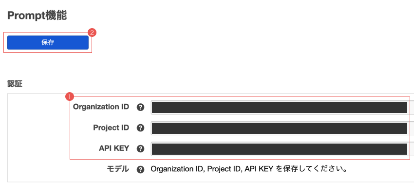
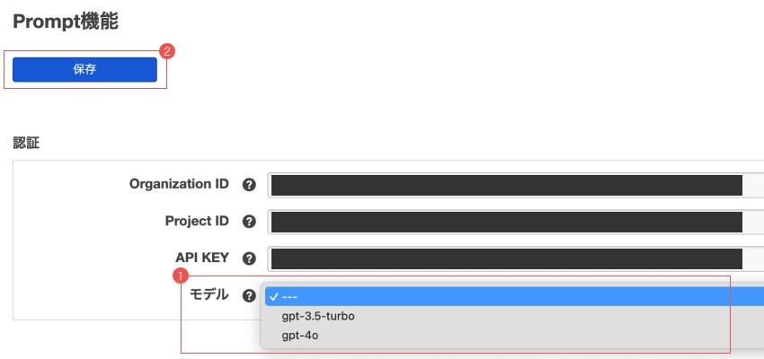
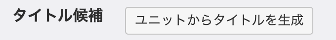
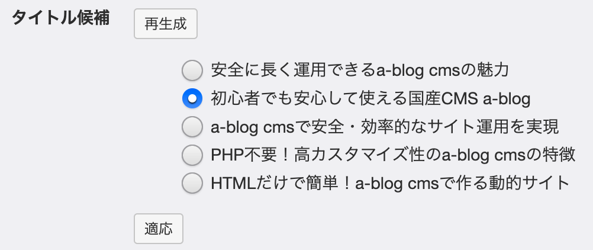
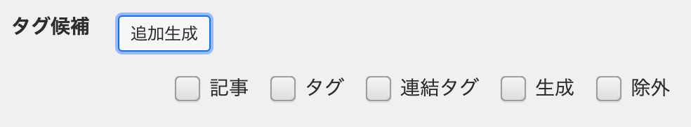

# AI拡張アプリ

a-blog cms の AI機能を拡張するアプリです。

## ダウンロード

最新版の拡張アプリは以下からダウンロードできます。

- [AI.zip をダウンロード（最新版）](https://github.com/appleple/acms-ai/releases/latest/download/AI.zip)

バージョンを指定してダウンロードしたい場合や過去のバージョンは [Releases](https://github.com/appleple/acms-ai/releases) を参照してください。

## 動作環境

- a-blog cms: Ver. 3.2.x (3.3+ not tested yet)
- PHP: 8.1 – 8.5 (8.6+ not tested yet)
- a-blog cms for Professional or Enterprise のみ（現状スタンダードライセンスでの利用はライセンス違反となります）

## サポートモデル

- OpenAI: API が返すモデルのうち、既定では一般用途の GPT-5.6・GPT-5.5・GPT-5.4 系
- Anthropic: API が返す利用可能モデルのうち、構造化出力に対応する Claude モデル
- Google Gemini: API が返す利用可能モデルのうち、構造化出力に対応する Gemini 2.5 / 3 系の Pro、Flash、Flash-Lite モデル
- OpenAI互換: 接続先が Chat Completions API で提供するモデル（モデル名は管理画面で手入力）

## 注意点

- API KEY によって利用できるモデルは異なります。使用したいモデルが表示されない場合は、各プロバイダの API KEY とモデルアクセス権を確認してください。
- API KEY とモデルは config として保存されます。保存済みの API KEY は管理画面へ再表示されず、空欄のまま保存すると現在の値を維持します。
- config はキャッシュを残します。設定が反映されない場合はダッシュボードからコンフィグキャッシュをクリアしてください。

管理画面に表示するモデル候補は、`private/config.system.yaml` の acms-ai 管理ブロックにある
`ai_openai_allowed_models`、`ai_anthropic_allowed_models`、`ai_gemini_allowed_models` で絞り込めます。
値は空白・カンマ・改行区切りで複数指定でき、`*` をワイルドカードとして使用できます。空の場合は、
各プロバイダが機能要件に基づいて列挙した全モデルを表示します。OpenAI のキー自体がまだ存在しない
旧環境でも同じ既定値として `gpt-5.6* gpt-5.5* gpt-5.4*` を使用します。最新の GPT-5.6 系を
候補に含めつつ、APIキーでまだ利用できない場合にモデル候補が空にならないよう GPT-5.5・GPT-5.4 系も
含めます。前方一致のため、APIキーに利用権限があれば用途特化モデルも候補に含まれる場合があります。
管理ブロックは拡張アプリの更新時に置き換わるため、個別の変更は更新後に再適用してください。

## インストール方法

拡張アプリをダウンロード後、zip ファイルを解凍して `extension/plugins/` に設置します。

設置が完了すると、「管理画面 -> 拡張アプリ」に `AI` という名前で本拡張アプリが表示されるので、インストールをクリックしインストールします。

## 使い方

### 準備：利用するプロバイダの認証情報を取得

OpenAI を利用する場合は `https://platform.openai.com/docs/overview` へログインし、
`Organization ID`、`Project ID`、`API KEY` を取得してください。

Anthropic を利用する場合は `https://platform.claude.com/` で API KEY を取得してください。

Google Gemini を利用する場合は `https://ai.google.dev/gemini-api/docs/api-key` から Google AI Studio の API Keys 画面を開き、`Create API key` で API KEY を取得してください。新規利用者には、利用規約への同意後にデフォルトの Google Cloud プロジェクトと API KEY が自動作成される場合があります。

有料枠へアップグレードする場合は、Google AI Studio の API Keys または Projects 画面にある `Set up billing` から請求情報を設定してください。詳細は `https://ai.google.dev/gemini-api/docs/billing` を参照してください。

さくらのAI Engine を利用する場合は `https://manual.sakura.ad.jp/cloud/ai-engine/02-howto.html` の
手順で利用開始後、左メニューの「アカウントトークン」からトークンを発行してください。発行された
`<UUID>:<シークレット>` 全体を OpenAI互換 API KEY に入力します。Base URL は既定の
`https://api.ai.sakura.ad.jp/v1` を使用し、モデル名はコントロールパネルの「利用可能なモデル」に
表示されたチャットモデル名（例: `gpt-oss-120b`）を入力してください。

その他の OpenAI 互換サービスでは、サービスが案内する Chat Completions の `/v1` 相当の Base URL、
Bearer トークン、チャットモデル名を入力してください。Base URL に入力した接続先へ記事本文や
チャット内容が送信されるため、信頼できる接続先だけを指定してください。HTTPS を必須とし、ローカル
開発用の `localhost` / ループバックだけ HTTP を許可します。

### 認証情報を `.env` で管理する

本番環境では、APIキーをa-blog cms設置ディレクトリ直下の `.env` から供給できます。環境変数は
管理画面に保存された値より優先され、管理画面のHTMLにも値を出力しません。

```dotenv
ACMS_AI_OPENAI_API_KEY=sk-...
ACMS_AI_OPENAI_ORGANIZATION_ID=org-...
ACMS_AI_OPENAI_PROJECT_ID=proj-...
ACMS_AI_ANTHROPIC_API_KEY=sk-ant-...
ACMS_AI_GEMINI_API_KEY=AIza...
ACMS_AI_COMPAT_API_KEY=...
```

OpenAI互換APIキーには `ACMS_AI_COMPAT_API_KEY` を使用してください。以前案内していた
`ACMS_AI_SAKURA_API_KEY` も互換名として利用できます。両方がある場合は
`ACMS_AI_COMPAT_API_KEY` が優先されます。

環境変数を追加した後にAI設定画面を一度保存すると、対応するDB上の旧認証情報が削除されます。
その後 `.env` から変数を削除した場合は自動的にDB値へ戻らないため、管理画面で認証情報を再設定してください。

`.env` には秘密情報が含まれます。ファイル権限を必要最小限（例: 所有者のみ読み書き可能）にし、
Webサーバーから `.env` へアクセスしたときに必ず `403` または `404` になることを確認してください。
a-blog cms同梱の `.htaccess` にはドットファイルのアクセス拒否がありますが、Nginxなど `.htaccess` を
使用しない構成ではWebサーバー側に同等の拒否設定が必要です。

#### Organization ID
`Setting > Organization > General` から取得できます。

#### Project ID
`Setting > Project > General` から取得できます。初期では Default Project が作成されていますが、利用するアプリケーション毎に作成することをお勧めします。利用量が Project ごとに確認できます。

#### API KEY
`Dashboard > API Keys` の `Create new secret Key` からキーが取得できます。この時、利用する `Project ID` を指定します。
※ User API Keys もありますが、この拡張アプリは対応しておりません。

### a-blog cms の管理画面設定
利用するプロバイダを選択し、準備で取得した認証情報を AI管理画面で入力して保存してください。
OpenAI は `Organization ID`、`Project ID`、`API KEY`、Anthropic と Google Gemini は `API KEY`、
OpenAI互換は `API KEY` と `Base URL` を使用します。



キーが正しく設定できると、モデルが選択できるようになります。利用するモデルを選択し、再度保存してください。
OpenAI互換ではモデル一覧 API が標準化されていないため、接続先で確認したモデル名を入力します。



認証が完了したら、「プロンプト設定」でタイトル生成・タグ生成の機能を有効にし、必要に応じてカスタムプロンプトを設定してください。

## エントリー編集AI機能
「AI機能」ラベルのアコーディオンがSEO設定の下に追加されます。

### タイトル生成機能
「ユニットからタイトルを生成」ボタンをクリックすると、ユニットを元にタイトルが生成されます。



「再生成」ボタンをクリックするとタイトルが再生成されます。再生成すると、前回作成したタイトルは消えてしまいますのでご注意ください。「適応」ボタンをクリックすることでタイトルに反映されます。エントリーの保存をしないと、エントリーのタイトルとして保存されないのでご注意ください。



### タグ生成機能
「ユニットからタグを生成」ボタンをクリックすると、ユニットを元にタグが生成されます。


「追加生成」ボタンをクリックすると、前回のタグに加えて追加で生成されます。追加生成では、a-blog cms 本来のタグ設定と ChatGPT で生成したタグで選択されているタグの情報も加えて生成されるので、より精度の高いタグが生成されます。エントリーの保存をしないと、エントリーのタグとして保存されないのでご注意ください。



## AIアシスタント機能

### ライトエディタ連携
ライトエディタにある「AIアシスタント」ボタンをクリックすると、画面右側にチャットドロワーが開きます。現在の編集内容を文脈として、テキストの校正・要約・翻訳・書き直しなど、自由に AI へ指示できます。結果は「挿入」ボタンでエディタへ反映されます。

### `<acms-ai-assistant-button>` Web Component
テンプレートから直接 AI アシスタントを呼び出せる Web Component です。任意の `<textarea>` をターゲットに指定することで、カスタムフィールドなどエントリー編集画面の任意の場所にAIボタンを追加できます。

この要素は **Light DOM** で動作します。子要素として書いた `<button>` がそのままボタンとして利用されるため、`acms-admin-btn` などの管理画面標準クラスや任意の CSS をそのまま適用できます。`<button>` を書かなかった場合は、要素内のテキストを内包する `<button class="acms-admin-btn">` が自動生成されます。

#### 属性

| 属性 | 必須 | 説明 |
|------|------|------|
| `target` | 必須 | 参照する textarea の CSS セレクター |
| `insert-target` | 任意 | 挿入先の textarea セレクター（省略時は `target` と同じ） |
| `prompt` | 任意 | 最初のメッセージとして送るプロンプト文字列 |
| `description` | 任意 | チャット欄の説明文 |
| `drawer-use` | 任意 | `"false"` を指定するとドロワーを開かずサイレント実行 |

#### スタイリング

Light DOM のため、外部 CSS（`acms-admin.css` の `.acms-admin-btn` など）がそのまま適用できます。子要素として書いた `<button>` に好きなクラスを付与してください。

```html
<acms-ai-assistant-button target="#body">
  <button type="button" class="acms-admin-btn">AIアシスタントを開く</button>
</acms-ai-assistant-button>
```

ローディング中は、ホスト要素（`<acms-ai-assistant-button>`）に `loading` 属性が付与され、ボタン内にローディング表示用の `<span>` が追加されます。スピナー等の標準スタイルは本拡張アプリの CSS で提供されますが、必要に応じて以下のクラスで上書きできます。

| クラス | 対象 |
|--------|------|
| `acms-ai-assistant-button__loading` | ローディング表示のコンテナ |
| `acms-ai-assistant-button__spinner` | デフォルトのスピナー |
| `acms-ai-assistant-button__sr-only` | スクリーンリーダー向けテキスト |

```css
acms-ai-assistant-button[loading] button {
  /* ローディング中のボタンの見た目を調整する例 */
  opacity: 0.7;
}
```

#### 使用例

**ドロワーを開いてチャットする（基本）**
```html
<acms-ai-assistant-button target="#body">
  <button type="button" class="acms-admin-btn">AIアシスタントを開く</button>
</acms-ai-assistant-button>
```

`<button>` を省略すると、テキストを内包したボタンが自動生成されます。

```html
<acms-ai-assistant-button target="#body">
  AIアシスタントを開く
</acms-ai-assistant-button>
```

**プロンプトを指定してドロワーを開く**
```html
<acms-ai-assistant-button
  target="#body"
  prompt="英語に翻訳してください。"
>
  <button type="button" class="acms-admin-btn">英訳する</button>
</acms-ai-assistant-button>
```

**ドロワーを開かずサイレント実行（自動校正など）**

`drawer-use="false"` を指定すると UI を表示せず即時実行します。AI のレスポンスから `<correction>` タグで囲まれた内容が自動的に textarea へ挿入されます。
もしレスポンスが安定しない場合、「修正後のテキストを &lt;correction&gt;&lt;/correction&gt; タグで囲んで返してください。」とpromptに付け足してください。

```html
<acms-ai-assistant-button
  target="#body"
  prompt="誤字脱字を修正してください。修正後のテキストを &lt;correction&gt;&lt;/correction&gt; タグで囲んで返してください。"
  drawer-use="false"
>
  <button type="button" class="acms-admin-btn">自動校正する</button>
</acms-ai-assistant-button>
```

**別フィールドへ結果を挿入する**

`insert-target` を指定すると、結果を別の textarea へ挿入できます。

```html
<acms-ai-assistant-button
  target="#body"
  insert-target="#title"
  prompt="英語に翻訳してください。"
  drawer-use="false"
>
  <button type="button" class="acms-admin-btn">タイトルを英訳して挿入</button>
</acms-ai-assistant-button>
```

**挿入時の改行形式を指定する**

通常は改行を `<br />` に変換して textarea へ挿入します。a-blog cms のテキストユニットで
`markdown`、`pre`、`none` などのソース系タグが選ばれている場合は、自動的に通常の改行を維持します。

独自の textarea で通常の改行を維持したい場合は、挿入先に
`data-acms-ai-insert-format="plain"` を指定してください。逆にソース系タグの自動判定より
HTML 形式を優先したい場合は `"html"` を指定できます。

```html
<textarea id="markdown-body" data-acms-ai-insert-format="plain"></textarea>

<acms-ai-assistant-button target="#markdown-body">
  <button type="button" class="acms-admin-btn">AIアシスタントを開く</button>
</acms-ai-assistant-button>
```

サイレント実行時は、ホスト要素に対して以下のカスタムイベントが発火します。処理状況に応じた UI 制御に利用できます。

| イベント名 | タイミング |
|-----------|-----------|
| `acms-ai:request-start` | AI へのリクエスト開始時 |
| `acms-ai:request-end` | AI のレスポンス受信完了時 |
| `acms-ai:before-insert` | textarea への挿入直前 |
| `acms-ai:after-insert` | textarea への挿入直後 |
